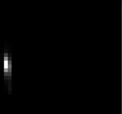
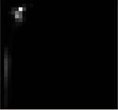
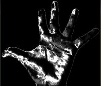

# 7月28日

# 反向投影

## 原理

* 以人体的皮肤举例
* 假设我们已经得到一个基于下图手部位皮肤的直方图(HIS格式)，这个直方图将代表我们手部的模型直方图(表示手部的色调)，我们将在测试图像中应用掩码以捕获仅属于手部皮肤的区域

  

  **T0**

  

  **T1**

* 假设我们得到了基于另一个手部位皮肤的图像(和他本身的直方图)

  
**T2**
  
**T3**

* 我们想要用我们的模型直方图(我们已经知道代表手部皮肤的色调)来探测测试图像手部的皮肤区域，总共分为以下几步

    1. 遍历测试图像中的每个像素(i.e. p(i, j))，采集他的数据并且找到符合这个像素的bins(i.e. $(h_{i,j}, s_{i,j})$)
    2. 查找直方图模型中的符合的bins-($h_{i,j}, s_{i,j}$)-并且读取bin的值
    3. 在新的图像(投影)存储bin的值。可以考虑现将直方图模型规范化，这样输出图像就可以称为可视的
    4. 在对测试图像应用以上步骤之后，我们得到了测试图像的投影图像
      
    5. 在统计学意义上，存储在BackProjection(投影)中的值代表这个测试图像中的像素可能属于皮肤的一部分，这个结论是基于我们的模型直方图得出的。以我们的测试用图举例，较亮部分更可能属于皮肤区域(他们确实是)，然而较暗的区域不太可能属于皮肤的区域(注意到较暗区域属于表面有阴影的部分，这些阴影反过来影响我们的探测)
