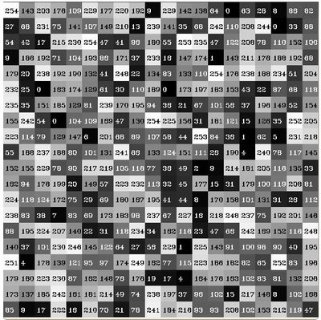

# 7月26日

## 直方图计算

* 直方图是将收集到的数据组织成预定义的集合
* 当说到数据时并不特指像素的强度．数据的形式可以是任何有用的形式来描述图像
* 用下图举例，假设一个矩阵包含了一个图像的信息(i.e. 强度值范围(0 -- 255))



* 如果要用一种有组织的方式对该数据计数，既然已经直到数据的强度范围是256，那么我们可以将其分段存储(每段称为一个桶)．
    $$
        \begin{array}{l} [0, 255] = { [0, 15] \cup [16, 31] \cup ....\cup [240,255] } \\ range = { bin_{1} \cup bin_{2} \cup ....\cup bin_{n = 15} } \end{array}
    $$
* 然后我们可以数出落在每个桶里面的像素数，经过上面的步骤我们可以得到下面的图片(x轴表示桶，y表示像素数)


* 指示出直方图中的元素
    1. dims 要收集的数据中的参数数量 dim = 1 表示我们只计量像素的强度值(对于灰度图而言)
    2. bins 桶，要收集的参数的细分数量，例子中　bins = 16
    3. range 范围，要测量的值的范围，例子中 range = [0, 255]

***

## `void cv::calcHist()`
---
```c++
      void cv::calcHist(const　Mat*      images,
                        int              nimages,
                        const int*       channels,
                        InputArray        mask,
                        OutputArray       hist,
                        int               dims,
                        const int *       histSize,
                        const float**     ranges,
                        bool              uniform = true,
                        bool              accumulate = false
                      )
```
---

* 计算一组数组的直方图
* 函数`cv::calcHist`计算一个或多个数组的直方图，用来增加桶中元素数量的元组中的元组取自数组中的相同位置．

### 参数
---
* images 　源图像数组，源中的每个数组应该有相同的深度，CV_8U, CV_16U 或 CV_32F，他们应该有相同的长度，每个图像可以有任意数量通道
* nimages  源图像的数量
* channels 用来生成直方图的通道列表，第一个通道范围是[0, images[0].channels - 1]，　第二个通道数量是[images[0].channels, images[0].channels + images[1].channels -1]
* mask   可选掩码，如果非空，那么它必须是与images[i]相同大小的八位深度的数组，非 0 掩码标记在直方图中计数的元素
* hist   输出直方图，这是一个稀疏或密集的dims维数组
* dims   直方图必须为正且不大于CV_MAX_DIMS(当前CV版本中是32)
* histSize  每个维度中的直方图大小数组
* range   每个维度中直方图bin边界的dims数组的数组．当直方图是均匀的对每个维度来说足够指定下边界
* uniform  直方图是否均匀的标志
* accumulate   累计标志，如果设置为true,直方图开始时不会被清除，可以从多个数组中计算单个直方图，或者及时更新直方图
