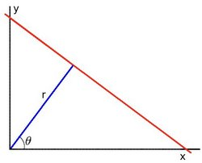

July 21, 2017 6:43 PM

## 霍夫线变换

**霍线变换是用于检测直线的变换**

* 空间中的一条直线可以用两个变量表示
	a.　在笛卡尔坐标系中　变量 (m , b) y = m * x + b
	b.	在极坐标系中，　变量　($$$(r,\theta)$$$)
	

* 霍夫变换中，我们在极坐标系中表示直线，直线的等式可以表示为
	$$
		y = \left ( -\dfrac{\cos \theta}{\sin \theta} \right ) x + \left ( \dfrac{r}{\sin \theta} \right )
	$$
* 重新整理等式得
	$$
		r = x \cos \theta + y \sin \theta
	$$

* 对于每个点$$$(x_{0}, y_{0})$$$，我们可以使用如下公式表示经过此点的曲线族
	$$
		r_{\theta} = x_{0} \cdot \cos \theta + y_{0} \cdot \sin \theta
	$$
	++ 每一对$$$(r_{\theta}, \theta)$$$表示经过此点的一条直线 ++
* 对于给定的$(x_{0}, y_{0})$，将其带入以上方程可以描述经过此点的直线族的方程，方程曲线为一个正弦曲线，以$x_{1} = 4, y_{1} = 6$举例，可以得到以下平面图
	
	++只考虑$r > 0, 0 < \theta < 2 \pi$的情况++

* 我们可以对一个图像中的所有点做以上的操作，如果两个点的曲线在平面$(\theta, r)$相交，说明两个点同属于一条直线．示例：在上图的基础上做另外两点的曲线$x_{1} = 4, y_{1} = 9 and y_{2} = 12, y_{2} = 3$
	
* 三条曲线都经过点(0.925, 9.6)，将此参数带入直线方程会发现上面三个点都会在此方程描述的直线上
* 上面的结论意味着可以通过找到曲线之间的交点数来检测线，同一交点曲线越多意味着这条直线经过的点越多，一般来说，我们可以定义检测直线所需的曲线数的最小阈值
* 霍夫线变换的原理就是如此，他跟踪图像中每个曲线之间的交点，如果交点数超过某个阈值，则将他声明为参数$(\theta, r_{\theta})$的直线