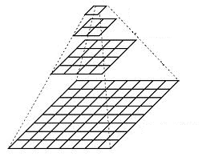
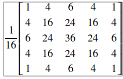
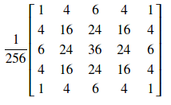

# 7月12日

## 图像金字塔

* 图像金字塔是由单个原始图像产生的图像的集合，而且是通过对原始图像连续降采样获得，
直到达到某个终止条件才停止降采样。(当然，降为一个像素肯定是终止条件)

* 有两种常见的图像金字塔
    1. **高斯金字塔**         用于缩减图像
    2. **拉普拉斯金字塔**      用于从金字塔中较低的图像重建上采样图像

### 高斯金字塔

---
* 高斯金字塔是一组层状结构的图形集合

    

* 层的编号从底部开始编号，所以　layer(i + 1) 小于　layer(i)
* 为了在高斯金字塔中产生　layer( i + 1 )，做以下几步
    1.  使用高斯内核与 layer(i) 做卷积运算
        >
    2. 移除每个偶数行和列
* 可以看到每个所得图像实际上是上一层的四分之一，以输入图像作为原图像，迭代上述过程生成图像金字塔
* 上述过程用于缩小图像，如果想要扩大图像的话，新增列并填充 0
    1. 首先将图像在每个维度上扩大两倍，
    2. 使用与上面相同的内核但是系数变为 4 执行卷积近似　丢失像素的值
* 这两个过程(上面所述的下采样和上采样)由 opencv 函数cv::pyrUp 和 cv::pyrDown　实现

> 注意，当对一个图像下采样时，实际上是丢失了图像的信息

## `void cv::pyrUp()`
---
        void cv::pyrUp(InputArray       src,
                       OutputArray      dst,
                       const Size&      dstsize = Size(),
                       INT              borderType = BORDER_DEFAULT
                       )
---

* 对一个图像进行上采样并模糊
* 默认情况下输出图像的大小为 Size(src.cols * 2, src.rows * 2)，但是在任何情况下都应该满足

            |dstsize.width - src.cols * 2| <= dst.width mod 2
            |dstsize.height - src.rows * 2| <= dst.height mod 2

* 该函数执行高斯金字塔构造的上采样步骤，尽管它实际上可用于构造拉普拉斯金字塔。
* 首先它通过注入偶数行和偶数列b并填充 0 对原图像进行抽样，然后使用 `void cv::pyrDown`
相同的内核但是系数变为**乘4**进行卷积

### 参数
---
* src               输入图像
* dst               输出图像，与输入图像有相同的类型
* dstsize           输出图像的大小
* borderType        像素外推法

## `void cv::pyrDown()`
---
            void cv::pyrDown(InputArray     src,
                             OutputArray    dst,
                             const Size&    dstsize = Size(),
                             INT            borderType = BORDER_DEFAULT
                             )
---

* 模糊一个图像并对其进行下采样
* 与 `void cv::pyrUp()`相同
* 该函数执行高斯金字塔构造的下采样步骤，首先他将原图像与内核卷积

    > 
* 然后它通过删除偶数行和偶数列来对图像进行下采样

### 参数
---
* src               输入图像
* dst               输出图像，与输入图像有相同的类型
* dstsize           输出图像的大小
* borderType        像素外推法