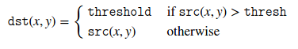

# 7月13日

## 基本阀值化操作

* 阀值化是一种简单的分段方法
* 应用举例: 从图片中分离出包含我们想         分离操作是基于物体的像素与
背景的像素有着较大的差异
* 为了从不感兴趣的背景中区分我们感兴趣的部分，我们将每个像素与一个阀值做比较
* 一旦我们分离出了想要的像素，就把它设置为一个预订的值来标记他们(i.e. 我们可以设置为0 (黑色)，
　255(白色)，或者其他合适的颜色)

## 阀值化操作的种类

* opencv　使用 `cv::threshold`　进行阀值化操作
* 我们可以使用这个函数作出五种阀值化操作
* 用下面的图像为例

 >

### 二值阀值化
---
* 二值阀值化操作可以用下面公式表示
    >
* 如果像素的值大于 thresh 那么，像素的值就会设置为maxVal，否则就会设置为 0
    >

### 反二值阀值化
---
* 这个操作可以理解为是二值阀值化的反操作
    >

### 截断
---
* 截断操作可以用下面的公式表示
    >
* 像素最大的强度是 thresh ，如果src(x, y) 大于 thresh ，那么就将它截断
    >

### 零截断
---
* 这个操作可以用下面的公式表示
    >
* 如果 src(x, y) 小于 threshold，那么就将它设置为 0
    >

### 反零截断
---
* 这个操作可以看作零截断的反操作
    >
* 如果 像素值大于 threshold，那么就将它设置为0
    >

##  `cv::threshold()`
---
            double cv::threshold(InputArray     src,
                                 OutputArray    dst,
                                 double         thresh,
                                 double         maxval,
                                 int            type
                                 )
---

* 对数组的每个元素使用固定阀值化
* 该函数对一个单通道数组使用固定阀值化。典型的应用是将灰度图转换为二值图像或者去除噪音
过滤掉过大或过小的值，阀值化操作取决于 type 操作
* 特殊值 `cv::THRESH_OTSU` 和 `cv::THRESH_TRIANGLE` 可以和其他操作结合，这种情况下
函数使用 Otsu 或 Triangle 算法决定最佳的阀值来代替指定的阀值。
* 函数返回计算出的阀值。目前， Otsu 和 Triangle 方法只支持八位深度的图像

### 参数
---
* src           输入图像，深度应为 8 bit　或　32 float-bit point
* dst           输出图像，大小和类型与输入图像相同
* thresh        制定的阀值
* maxval        使用 `THRESH_BINARY`　和　`THRESH_BINARY_INV`　指定的最大值
* type          阀值化操作类型

## `cv::ThresholdTypes`

* 阀值化操作类型定义在 `cv::ThresholdTypes` 中

    >

### `THRESH_BINARY`
* 二值阀值化
---

### `THRESH_BINARY_INV`
* 反二值阀值化

---
### `THRESH_TRUNC`
* 截断操作
---
### `THRESH_TOZERO`
* 零截断操作
---
### `THRESH_TOZERO_INV`
* 反零截断操作
---
### `THRESH_MASK`
* 掩码
---
### `THRESH_OTSU`
* 使用 otsu 算法计算最佳阀值
---
### `THRESH_TRIANGLE`
* 使用 triangle 算法计算最佳阀值
