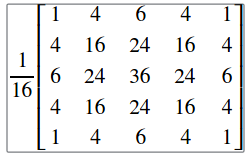
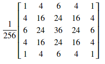

# 7月１日　opencv 笔记

### `cv::Mat cv::imread(const string& filename, int flag = IMREAD_COLOR)`

* 这个函数从filename文件中载入一个图像并返回cv::Mat
* 如果这个图像载入失败，那么就会返回一个空的cv::Mat
* 注意，函数以文件内容判断图像的格式而不是文件的后缀名
* 对于彩色图像来说，解码后图像的通道的顺序是　B G R

### 参数说明
* filename 图像的文件名
* flag      可以从[cv::ImreadModes](http://docs.opencv.org/3.2.0/d4/da8/group__imgcodecs.html#ga61d9b0126a3e57d9277ac48327799c80)中取值

## `void cv::cvtColor(InputArray src, OutputArray dst, int code, int dstCn = 0)`

* 将src图像从一个颜色空间转换到另一个颜色空间，输出到dst中

### 参数说明
* src 输入图像
* dst  输出图像，要与src一样大小和形状
* code 色彩空间转换码，[cv::ColorConversionCodes](http://docs.opencv.org/3.2.0/d7/d1b/group__imgproc__misc.html#ga4e0972be5de079fed4e3a10e24ef5ef0)

***
# 7月13日

---
    void cv::filter2D(  InputArray src,
                        OutputArray dst,
                        int ddepth,
                        InputArray kernel,
                        Point   anchor = Point(-1, -1)
                        double delta = 0,
                        int borfer_type = BORDER_DEFAULT
                        )

---

* 使用核函数(kernel)对输入图像(src)进行卷积操作，输出到dst上
* 参考点(anchor)默认值表示核函数中心
* 该函数实际上并不是卷积操作，而是在计算相关性
* 真正的卷积操作使用`cv::flip()`反转内核并将参考点设置为 `(kernel.cols - anchor.x - 1, kernel.rows - anchor.y - 1)`

### 参数

* ddepth        目标图像的所需深度
* kernel        卷积内核，单通道浮点矩阵，如果要把不同的内核用于不同的通道，用拆分将图像分割成单独的通道平面并单独处理
* delta         将可选值添加到滤波像素中
* border_type   像素外推的方法，也就是处理边界的方法

***

# 7月4日

---

    void cv::addWeighted( InputArray  src1,
                          double      alpha,
                          InputArray  src2,
                          double      beta,
                          double      gamma,
                          OutputArray dst,
                          INT         dtype = -1
                         )

---

* 计算两个矩阵的权和，对图像而言是将两个图像alpha融合，公式如下

        dst(I) = saturate(src(I) * alpha + src(I) * beta + gamma)

> 注：在多通道图像的情况下，每个通道都会单独进行处理

### 参数说明

* src1          第一个图像
* alpha         第一个图像的权重
* src2          第二个图像
* beta          第二个图像的权重
* gama          两图像融合式的所相加的偏移量
* dtype         输出矩阵的可选深度，当两个矩阵具有相同的深度时，dtype设置为-1，相当于src1.depth()

***

# 7月7日

## `void cv::blur()`
---
            cv::blur(InputArray         src,
                     OutputArray        dst,
                     Size               ksize,
                     Point              anchor = Point(-1, -1);
                     INT                borderType = BORDER_DEFAULT
                     )
---

* 使用归一化盒式过滤器模糊图像

### 参数
---
*   src         输入图像，可以有任意数量的通道，每个通道都是独立处理的，但深度应为 CV_8U, CV_16U, CV_16S, CV_32F 或　CV_64F
*   dst         输出与src相同尺寸和类型的图像
*   ksize       模糊内核的大小
*   anchor      参考点
*   borderType  外推图像边框的像素类型

## `void cv::GaussianBlur()`
---
            void cv::GaussianBlur(InputArray    src,
                                  OutputArray   dst,
                                  Size          ksize,
                                  double        sigmaX,
                                  double        sigmaY = 0,
                                  INT           borderType = BORDER_DEFAULT
                                  )
---

* 使用高斯滤波器模糊图像
* 该函数将使用指定的高斯核与输入图像进行卷积，支持就地操作

### 参数
---
*   src         输入图像，与上面的要求相同
*   dst         输出与src相同尺寸和类型图像
*   ksize       高斯核的尺寸，　ksize.height 与　ksize.width 可以不相同，但必须是正奇数，如果为零的话用sigma计算
*   sigmaX      X方向的高斯核标准偏差
*   sigmaY      Y方向的高斯核标准偏差
*   borderType  像素外推法

## `void cv::medianBlur()`
---
            void cv::medianBlur(InputArray      src,
                                OutputArray     dst,
                                INT             ksize
                                )
---

* 使用中值滤波器模糊图像
* 该函数使用中值滤波器平滑图像，独立处理多个通道，支持就地操作

### 参数
---
*   src         输入1, 3 或　4 通道的图像，当ksize为　3 或 5 时，图像深度应为 CV_8U, CV_16U　或　CV_32F，　对于较大的光圈，深度只能为 CV_8U
*   dst         输出与src相同尺寸和类型的图像
*   ksize       光圈的孔径尺寸，必须是正奇数

### `void cv::bilateralFilter()`
---
            void cv::bilateralFilter(InputArray     src,
                                     OutputArray    dst,
                                     INT            d,
                                     double         sigmaColor,
                                     double         sigmaSpace,
                                     INT            borderType = BORDER_DEFAULT
                                     )
---

* 将双边滤镜应用于图像
* 该函数对输入图像进行双边过滤，可以很好去除噪声同时保持边缘的锐利，但是速度非常慢
* sigma：简单的情况下，两个sigma的值可以设为相同，如果很小($<10$),那么过滤器的影响不会很大，如果很大($>150$)，过滤器的效果会非常强大，使图像看起来很 "卡通"

* 滤波器大小：大滤波器(d > 5)非常慢，建议对实时应用使用　d = 5 ，对需要大噪声滤波的离线应用应用 d = 9　也可以
* 该滤波器不支持就地操作

### 参数
---
*   src         CV_8U 或　CV_32F，单通道或单通道的图像
*   dst         输出与src相同尺寸和类型的图像
*   d           过滤期间使用的每个像素邻域的直径，如果是非正的，将会从sigma计算得出
*   sigmaColor  过滤器在颜色空间的sigma值，sigma较大会使像素邻域中的更多颜色混合到一起，导致较大的半等色区域
*   sigmaSpace  过滤器在坐标空间的sigma值，sigma较大意味着只要颜色足够接近，距离较远的像素也会相互影响。当 d > 0时，无论sigmaSpace如何，都会指定邻域大小，否则，d 与　sigmaSpace成反比
*   borderType  像素外推法

***

# 7月8日

## 　`void cv::dilate()`
--------------------
            void cv::dilate(InputArray      src,
                            OutputArray     dst,
                            InputArray      kernel,
                            Point           anchor = Point(-1, -1),
                            INT             iterations = 1,
                            INT             borderType = BORDER_DEFAULT,
                            const Scalar&   borderValue = morphologyDefaultBorderValue()
                            )
---

* 使用特定的结构膨胀图像
* 该函数使用特定的结构膨胀图像，具体是在kernel下的参考点取局部最大值
* 每个通道独立处理，支持就地操作

### 参数
---
* src           输入图像，通道数任意，但是深度应该是 CV_8U, CV_16U, CV_16S, CV_32F, CV_64F之一
* dst           输出图像，与输入图像有相同的尺寸和类型
* kernel        用于扩张的结构元素，如果　element = Mat()，则是用　3 × 3　的结构元素，可以使用 `getStructuring()`创建内核
* anchor        参考点在kernel的位置，Point(-1, -1)表示参考点位于kernel中央
* iterations    函数执行的膨胀操作次数
* borderType    像素外推法
* borderValue   边界值

## `void cv::erode()`
---
            void cv::erode(InputArray       src,
                           OutputArray      dst,
                           InputArray       kernel,
                           Point            anchor = Point(-1, -1),
                           INT              iterations = 1,
                           INT              borderType = BORDER_DEFAULT,
                           const Scalar&    borderValue = morphologyDefaultBorderValue()
                           )
---

* 使用特定的元素腐蚀图像
* 该函数使用特定的结构腐蚀图像，具体是参考点取结构元素中的最小值
* 每个通道单独处理，支持就地操作

### 参数
---
* src           输入图像，要求与dilate相同
* dst           输出图像，与上相同
* kernel        用于扩张的结构元素，与上相同
* anchor        参考点的未知
* iterations    函数执行的腐蚀操作的次数
* borderType    像素外推法
* borderValue   像素值

## `void cv::getStructuringElement()`
---
            void cv::getStructuringElement(INT      shape,
                                           Size     ksize,
                                           Point    anchor = Point(-1, -1)
                                           )
---

* 返回形态操作的指定大小的和形状的结构元素
* 可以构造并返回传递给`cv::erode`，　`cv::dilate`，`cv::morphologyEx`

### 参数
---
* shape         元素值可以取 `MORPH_RECT`，　`MORPH_CROSS`和`MORPH_ELLIPSE`分别表示矩形，十字和椭圆
* ksize         结构元素的大小
* anchor        参考点的位置，只有十字性内核的形状取决于参考点的位置，其他情况下参考点只调节形态操作的结果发生了多少偏移

***

# 7月9日

# `void cv::morphologyEx()`
---
            void cv::morphology(InputArray      src,
                                OutputArray     dst,
                                INT             op,
                                InputArray      kernel,
                                Point           anchor = Point(-1, -1),
                                INT             iterations = 1,
                                INT             borderType = BORDER_CONSTANT,
                                const scalar&   borderValue = morphologyDefaultBorderValue()
                                )
---

* 该函数提供高级的形态学操作，具体操作类型由　op 参数提供
* 高级的形态学操作是以膨胀和腐蚀为基础进行的
* 任何操作都支持就地操作，当图像是多通道时，每个通道都会单独的处理

### 参数
---
* src           输入图像，通道数任意，但是图像深度应该是 CV_8U, CV_16U, CV_16S, CV_32F, CV_64F之一
* dst           输出图像，与输入相同尺寸和类型
* op            形态操作的类型
* kernel        结构元素，通过`cv::Mat cv::getStructuringElement()`得到
* anchor        参考点的位置，默认是在图像中央
* iterations    腐蚀和膨胀的次数
* borderType    像素外推法
* borderValue   边界的常量像素值，默认值有特殊含义

# 形态学操作

* 所有形态学操作类型都在 `cv::MorphTypes` 枚举类型中定义

## open(开运算)

### `cv::MorphTypes::MORPH_OPEN`

* 先将图像腐蚀，再将图像膨胀得到的
* 用于去除小物体(假设物体在黑暗的前景上是明亮的)

---
## close（闭运算）
### `cv::MorphTypes::MORPH_CLOSE`

* 与open(开运算)相反，是先将图像膨胀，再将图像腐蚀得到的
* 用于去除小孔(假设小孔是在明亮的前景上是黑暗的)

---
## Morphological Gradient(形态学梯度)
### `cv::MorphTypes::MORPH_GRADIENT`

* 将图像分别做膨胀和腐蚀运算后两结果做差得到
* 用于找到物体的轮廓
---
## Top Hat(礼帽)
### `cv::MorphTypes::TOPHAT`

* 原图像与图像做开运算后做差得到

---
## Black Hat(黑帽)
## `cv::MorphTypes::BLACKHAT`

* 图像做闭运算与原图像做差得到

***

# 7月12日

## 图像金字塔

* 图像金字塔是由单个原始图像产生的图像的集合，而且是通过对原始图像连续降采样获得，
直到达到某个终止条件才停止降采样。(当然，降为一个像素肯定是终止条件)

* 有两种常见的图像金字塔
    1. **高斯金字塔**         用于缩减图像
    2. **拉普拉斯金字塔**      用于从金字塔中较低的图像重建上采样图像

### 高斯金字塔

---
* 高斯金字塔是一组层状结构的图形集合

    

* 层的编号从底部开始编号，所以　layer(i + 1) 小于　layer(i)
* 为了在高斯金字塔中产生　layer( i + 1 )，做以下几步
    1.  使用高斯内核与 layer(i) 做卷积运算
        >
    2. 移除每个偶数行和列
* 可以看到每个所得图像实际上是上一层的四分之一，以输入图像作为原图像，迭代上述过程生成图像金字塔
* 上述过程用于缩小图像，如果想要扩大图像的话，新增列并填充 0
    1. 首先将图像在每个维度上扩大两倍，
    2. 使用与上面相同的内核但是系数变为 4 执行卷积近似　丢失像素的值
* 这两个过程(上面所述的下采样和上采样)由 opencv 函数cv::pyrUp 和 cv::pyrDown　实现

> 注意，当对一个图像下采样时，实际上是丢失了图像的信息

## `void cv::pyrUp()`
---
        void cv::pyrUp(InputArray       src,
                       OutputArray      dst,
                       const Size&      dstsize = Size(),
                       INT              borderType = BORDER_DEFAULT
                       )
---

* 对一个图像进行上采样并模糊
* 默认情况下输出图像的大小为 Size(src.cols * 2, src.rows * 2)，但是在任何情况下都应该满足

            |dstsize.width - src.cols * 2| <= dst.width mod 2
            |dstsize.height - src.rows * 2| <= dst.height mod 2

* 该函数执行高斯金字塔构造的上采样步骤，尽管它实际上可用于构造拉普拉斯金字塔。
* 首先它通过注入偶数行和偶数列b并填充 0 对原图像进行抽样，然后使用 `void cv::pyrDown`
相同的内核但是系数变为**乘4**进行卷积

### 参数
---
* src               输入图像
* dst               输出图像，与输入图像有相同的类型
* dstsize           输出图像的大小
* borderType        像素外推法

## `void cv::pyrDown()`
---
            void cv::pyrDown(InputArray     src,
                             OutputArray    dst,
                             const Size&    dstsize = Size(),
                             INT            borderType = BORDER_DEFAULT
                             )
---

* 模糊一个图像并对其进行下采样
* 与 `void cv::pyrUp()`相同
* 该函数执行高斯金字塔构造的下采样步骤，首先他将原图像与内核卷积

    > 
* 然后它通过删除偶数行和偶数列来对图像进行下采样

### 参数
---
* src               输入图像
* dst               输出图像，与输入图像有相同的类型
* dstsize           输出图像的大小
* borderType        像素外推法

***
# 7月16日

## `void cv::inRange()`
---
            void cv::inRange(InputArray         src,
                             InputArray         lowerb,
                             InpurArray         upperb,
                             OutputArray        dst
                             )
---

* 检查数组元素是否位于另外两个数组之间
* 函数用下面的方式检查元素是狗在区间内
    1. 单通道的每个元素

            dst(I) = lowerb(I) <= src(I) <= upperb(I)
    2. 对于多通道的每个元素

            dst(I) = lowerb(I1) <= src(I1) <= upperb(I1)
                        &&  lowerb(I2) <= src(I2) <= upperb(I2)
* 因此，如果像素在区间内的话酒鬼被设置为 255 ，否则就会设置为 0
* 如果 lowerb 或 upperb　是 cv::scalars , 那么下标就可以省略

### 参数
---
* src           输入图像
* lowerb        区间的下界或一个标量
* upperb        区间的上界或一个标量
* dst           输出图像，与src有相同的尺寸，深度为 CV_8U

***

July 22, 2017 2:31 PM

## `void cv::HoughLinesP()`
---
		void cv::HoughLinesP(
								InputArray		image,
								OutputArray		lines,
								double			rho,
								double			theta,
								int				threshold,
								double			minLineLength = 0,
								double			maxLineGap = 0
							)
---

* 在二值图像中使用霍夫概率算法找到直线

### 参数说明
---
* src			输入图像，深度应为 8 位，单通道的二值图像，图像可能会被函数更改
* lines			输出直线的向量集合，每条线用一个四维向量表示$(x_{1}, y_{1}, x_{2},y_{2})$
* rho			累加器以像素为单位执行的步长
* theta			累加器的角度分辨率，以弧度为单位
* threshold		累加器阈值参数，只有交点数超过阈值才会被认为是直线
* minLineLength	最小线长，比此短的都要被拒绝
* maxLineGap	同一条线上点之间的最大间隙

***

# July 23, 2017 8:34 PM

## `void cv::HoughCircles()`
---
			void cv::HoughCircles(
									InputArray			image,
									OutputArray			circles,
									int 				method,
									double				dp,
									double				minDist,
									double				param1 = 100,
									double				param2 = 100,
									int					minRadius = 0,
									int 				maxRadius = 0
									)
---

* 该函数用霍夫变换从灰度图中找到圆

### 参数
---
* image				输入图像应为8 位，单通道的灰度图
* circles			从图中找到的圆的集合，每个圆用一个三元组表示，三元组用三个浮点数表示($x, y, radius$)
* method			探测方法，表示在`cv::HoughModes`枚举类型中，目前只有`cv::HoughModes::HOUGH_GRADIENT`被实现
* dp				累加器分辨率和图像分辨率的反比，如果 dp = 1，那么累加器将于图像有相同的分辨率，如果dp = 2,那么累加器将只有图像分辨率的一半
* minDist			两探测到的圆心之间所允许的最小距离，如果过小会探测到过多相邻圆，如果过大会错过一些圆
* param1			第一种方法指定参数，在CV_HOUGH_GRADIENT情况下，较高的阈值会传递给Canny边缘探测器
* param2			第二种方法指定参数，在CV_HOUGH_GRADIENT情况下，是探测圆心的累加器阈值．越小越可能探测越多的假圆
* minRadius			最小圆半径
* maxRadius			最大圆半径